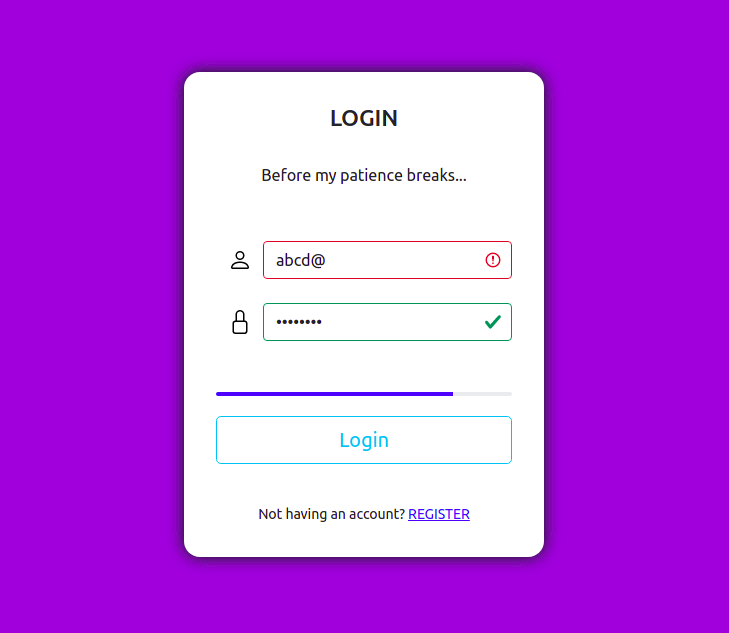

## Login screen ( Javascript )
A simple login page written for web embedded with functionalities mentioned below :

- Email validator
- Password validator
- Password strength indicator

 

### Live demo
https://accelerator-one.github.io/login-screen-javascript/public/index.html

 

### Screenshot

 

### Validation criteria
Criteria(s) for password strength indicator are mentioned below :

- On basis of word length

    | Word length | Strength |
    |:------------|:--------:|
    | 2 - 4       | 10 %     |
    | 4 - 6       | 20 %     |
    | 6 - 8       | 30 %     |
    | 8 +         | 60 %     |
    
 

- On basis of character presence

    | Character | Strength |
    |:----------|:--------:|
    | A - Z     | 10%      |
    | a - z     | 10%      |
    | 0 - 9     | 10%      |
    | *Special* | 10%      |
